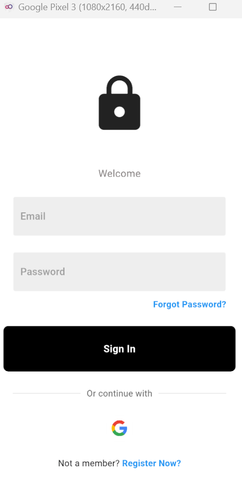
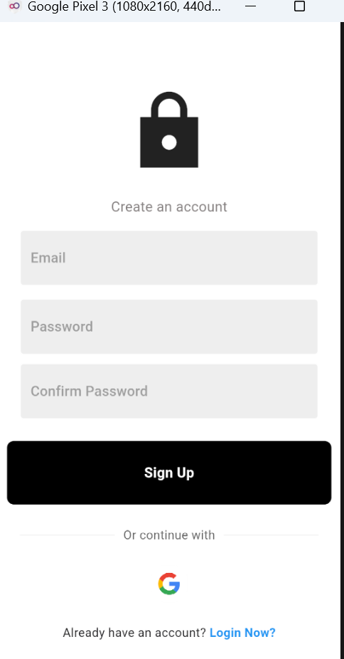
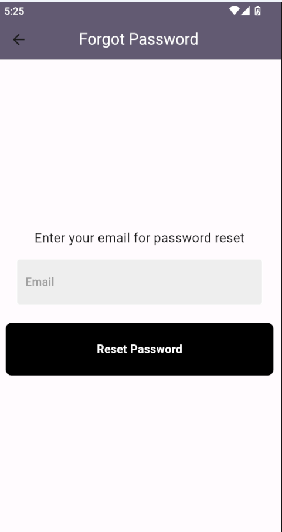
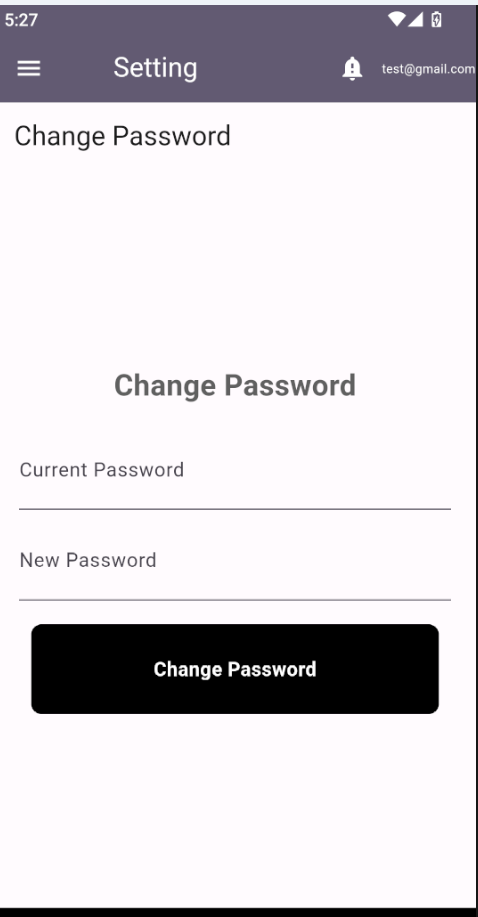
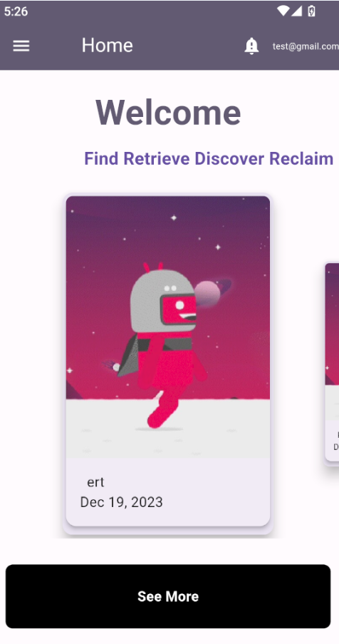
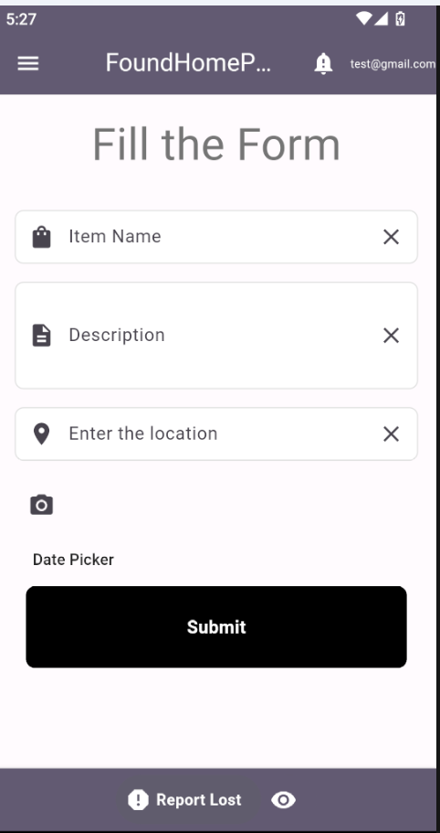
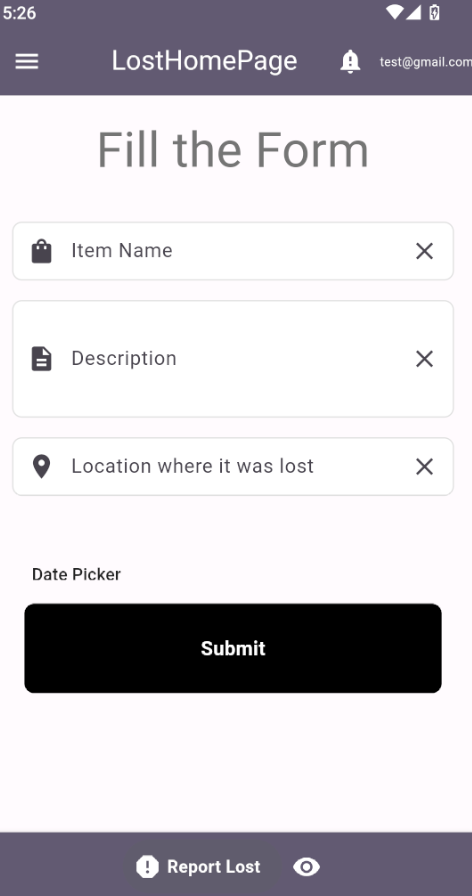
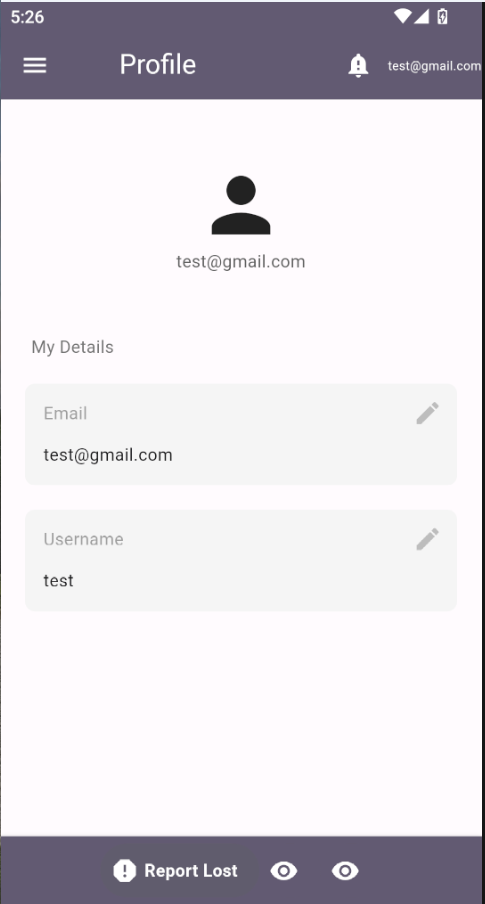
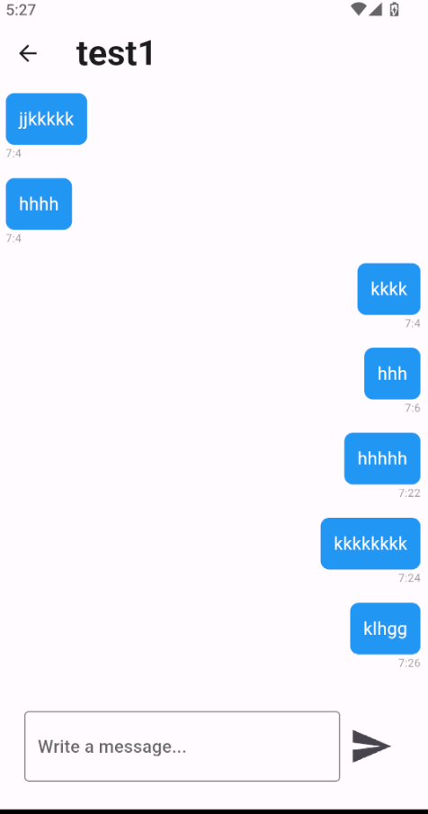

# Lost and Found Flutter App

Welcome to the Lost and Found Flutter App! This Flutter application helps users report lost items and discover found items within a community.

## Features

- **Report Lost Items:** Users can easily report items they have lost, providing details such as item description, location, and time of loss.

- **Discover Found Items:** Browse through a list of found items to see if someone has found what you've lost.

- **Claiming Found Items:** If you spot your lost item in the found section, follow the instructions to claim it and arrange for retrieval.

## Getting Started

1. **Flutter Installation:**
   - Make sure you have Flutter installed on your machine. If not, follow the [Flutter Installation Guide](https://flutter.dev/docs/get-started/install).

2. **Clone the Repository:**
   - Clone the Flutter Lost and Found app repository to your local machine.
     ```bash
     git clone https://github.com/Ebenezer-Mulu/Lost-and-Found.git
     ```

3. **Navigate to the Project:**
   - Change into the project directory.
     ```bash
     cd lost-and-found-flutter-app
     ```

4. **Flutter Packages:**
   - Fetch the necessary Flutter packages.
     ```bash
     flutter pub get
     ```

5. **Run the App:**
   - Start the Flutter application.
     ```bash
     flutter run
     ```

6. **Usage:**
   - Open the app on your emulator or connected device and navigate through the features to report lost items or discover found items.

## Contributing

If you would like to contribute to the development of the Lost and Found Flutter App, follow these steps:

1. Fork the repository.
2. Create a new branch for your feature or bug fix.
3. Make your changes and submit a pull request.


## Contact

If you have any questions or issues, feel free to contact us at [ebenmulu@gmail.com](mailto:ebenmulu@gmail.com).

Happy searching and finding with Flutter!


# Lost-and-Found-Flutter-app










